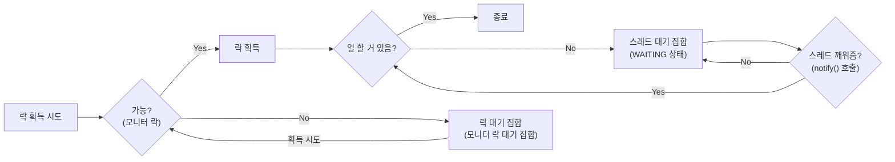

# 생산자 소비자 문제

### 문제 발생 상황
**생산자가 너무 빠를 때**
- 버퍼가 가득 차서 더 이상 데이터를 넣을 수 없을 때까지 생산자가 데이터를 생성
- 버퍼가 가득 찬 경우 생산자는 버퍼에 빈 공간이 생길 때까지 기다려야 함

**소비자가 너무 빠를 때**
- 버퍼가 비어서 더 이상 소비할 데이터가 없을 때까지 소비자가 데이터를 처리
- 버퍼가 비어있을 때 소비자는 버퍼에 새로운 데이터가 들어올 때까지 기다려야 함

 

### 생산자 소비자 문제 (producer-consumer problem)
- 생산자 소비자 문제는 생산자 스레드와 소비자 스레드가 특정 자원을 함께 생산하고, 소비하면서 발생하는 문제
- 이 문제는 결국 중간에 있는 버퍼의 크기가 한정되어 있기 때문에 발생함. 따라서 이를 **한정된 버퍼 문제**(bounded-buffer problem) 문제라고도 함

# 예제의 해결 과정
## 예제 1. 단순히 프로듀서, 컨슈머, 버퍼가 존재하고, 임계 영역으로 접근만 제어하는 경우
### 문제점
- 버퍼가 가득 찬 경우, 프로듀서는 버퍼에 넣지 못 하고 데이터를 버리는 경우 발생
- 버퍼가 비어있는 경우, 컨슈머는 데이터를 가져오지 못하고 `null`을 반환하는 경우 발생

### 그럼 어케 해야 함?
> 데이터를 넣을 수 있을 때까지 또는 데이터를 가져올 수 있을 때까지 기다려보자 
- 버퍼가 가득 찬 경우, 프로듀서는 버퍼에 넣을 때까지 기다려야 함 (`sleep()`)
- 버퍼가 비어있는 경우, 컨슈머는 버퍼에 데이터가 들어올 때까지 기다려야 함 (`sleep()`)

 

## 예제 2. 프로듀서와 컨슈머에 `sleep()`을 적용
### 문제점
생산자를 먼저 실행한 경우
- `producer3` 이 종료되지 않고 계속 수행됨
- `consumer1` , `consumer2` , `consumer3` 은 `BLOCKED` 상태가 됨

소비자를 먼저 실행한 경우
- 소비자 먼저 실행의 경우 `consumer1` 이 종료되지 않고 계속 수행
- 나머지 모든 스레드가 `BLOCKED` 상태가 됨

### 원인
생산자를 먼저 실행한 경우
- `buffer` 가 가득 찼기 때문에 `producer3` 이 반복문을 돌면서 계속 대기
- `producer3`이 `put()`을 통해 Lock을 획득한 채로 대기하고 있기 때문에 다른 스레드들은 Lock을 획득할 수 없음

소비자를 먼저 실행한 경우
- `buffer` 가 비어있기 때문에 `consumer1` 이 반복문을 돌면서 계속 대기

### 그럼 어케 해야 함?
> 아무일도 하지 않고 대기하는 동안 잠시 다른 스레드에게 락을 양보하자
- `sleep()`을 사용하니까 Lock을 점유한 채로 그냥 대기
-  `Object.wait()` , `Object.noitfy()` 를 사용하면 락을 가지고 대기하는 스레드가 대기하는 동안 다른 스레드에게 락을 양보할 수 있음

 

## wait(), notify() 설명
### `Object.wait()`
- 현재 스레드가 가진 락을 반납하고 대기( `WAITING` )
- 현재 스레드를 대기( `WAITING` ) 상태로 전환
- 이 메서드는 현재 스레드가 `synchronized` 블록이나 메서드에서 락을 소유하고 있을 때만 호출할 수 있음
- 호출한 스레드는 락을 반납하고, 다른 스레드가 해당 락을 획득할 수 있도록 함
- 이렇게 대기 상태로 전환된 스레드는 다른 스레드가 `notify()` 또는 `notifyAll()` 을 호출할 때까지 대기 상태를 유지

### `Object.notify()`
- 대기 중(pool)인 스레드 중 하나를 깨움
- 이 메서드는 `synchronized` 블록이나 메서드에서 호출되어야 함
- 깨운 스레드는 락을 다시 획득할 기회를 얻게 됨
- 만약 대기 중인 스레드가 여러 개라면, 그 중 임의의 하나만이 깨워지게 됨 (랜덤 게임)
  - 하지만 대체로 오래 기다린 스레드가 깨어남 (100% 보장은 없음) 

### `Object.notifyAll()`
- 대기 중(pool)인 모든 스레드를 깨움
- 이 메서드 역시 `synchronized` 블록이나 메서드에서 호출되어야 하며, 모든 대기 중인 스레드가 락을 획 득할 수 있는 기회를 얻게 됨
- 이 방법은 모든 스레드를 깨워야 할 필요가 있는 경우에 유용

 

## 예제 3. `Object.wait()` , `Object.noitfy()`을 적용
> 잘 되긴 함ㅋㅋ. 근데 비효율적임 (같은 종류의 스레드를 깨울 때)

### 문제점
생산자를 먼저 실행한 경우
- `producer3`이 큐에 못 넣는 상황에서 `wait()`을 통해 락 반납
- `consumer1`가 소비하고, `notify()`을 통해 `producer3`를 깨움 (비효율임, 어차피 못 넣음)
- `producer3`가 다시 락을 획득하고 큐에 데이터를 넣음

소비자를 먼저 실행한 경우
- 소비자 먼저 실행의 경우 `consumer1`이 데이터를 소비하지 못 하는 상황에서 `wait()`을 통해 락 반납
- `consumer2`, `consumer3`가 계속 `wait()` 돌림
- `producer1`이 데이터를 넣고, `notify()`을 통해 소비자 하나 깨움
- 깨어난 소비자가 데이터를 소비하고, `notify()`을 통해 다른 소비자 깨움

추가로 스레드 기아(thread starvation) 문제로 발생할 수 있음
- `notify()`의 또 다른 문제점으로는 어떤 스레드가 깨어날지 알 수 없음 (스레드 기아)
- 물론 `notifyAll()`을 사용하면 (스레드 기아 문제만) 해결할 수 있음
  - 근데 락을 획득했어야 (가장 효율적인) 스레드가 제일 늦게 락을 획득하면 비효율로 이어짐

### 원인
대기 상태에 빠진 같은 종류의 스레드를 깨울 때 비효율 발생
- 생산자가 같은 생산자를 깨우거나, 소비자가 같은 소비자를 깨울 때 비효율이 발생

스레드가 대기하는 대기 집합이 하나이기 때문에 원하는 스레드를 선택해서 깨울 수 없음

### 그럼 어케 해야 함?
생산자 스레드는 데이터를 생성하고, 대기중인 소비자 스레드에게 알려주어야 함, 반대로 소비자 스레드는 데이터를 소비하고, 대기중인 생산자 스레드에게 알려주면 됨

생산자 스레드가 대기하는 대기 집합과, 소비자 스레드가 대기하는 대기 집합을 둘로 나누자
- `syncrhonized`은 이 문제를 해결할 수 없음
- `ReentrantLock`을 사용해보자

 

## 예제 4. `ReentrantLock` 맛보기
> Lock 맛보기임. 대기 공간 분리하지 않아서 예제 3과 동일, 빠르게 예제 5로 넘어가자

### `Lock`과 `Condition` 활용

- Lock(`lock()`, `unlock()`)을 통해 임계 영역을 정의
- Condition(`await()`, `signal()`)을 통해 스레드 대기 공간을 정의
  - `await()` : 대기 상태로 전환 (`Object.wait()`과 유사)
  - `signal()` : 대기 중인 스레드를 깨움 (`Object.notify()`과 유사)

### 문제점 & 원인
대기 공간을 분리하지 않아서 `syncrhonized`와 동일한 문제 발생

대기 공간을 분리하지 않아서 원하는 스레드를 깨울 수 없음

### 그럼 어케 해야 함?
`Condition`을 사용해서 스레드 대기 공간을 정의했음을 알 수 있음

이를 이용해서 생산자 대기 그룹(`condition1`)과 소비자 대기 그룹(`condition2`)을 나눠보자

 

## 예제 5. `ReentrantLock`과 `Condition`을 적용
> 락(`Lock`)은 1개, 대기 공간(`Condition`)은 2개로 나누어서 생산자와 소비자 스레드의 대기 공간 분리

대기 공간을 분리해서 원하는 스레드를 깨울 수 있음
- 생산자는 소비자를 깨우고, 소비자는 생산자를 깨움

소비자가 소비자를 깨운다거나, 생산자가 생산자를 깨우지 않기 때문에 효율적임

이렇게 효과적이라면 누군가 이걸 만들어놓지 않았을까? -> `BlockingQueue`

 

> 예제 6에 들어가기 앞서...

### Object.notify() vs Condition.signal() 비교
`Object.notify()`
- 대기 중인 스레드 중 임의의 하나를 선택해서 깨움
  - 스레드가 깨어나는 순서는 정의되어 있지 않으며, JVM 구현에 따라 다름
  - 보통은 먼저 들어온 스레드가 먼저 수행되지만 구현에 따라 다를 수 있음
- `synchronized` 블록 내에서 모니터 락을 가지고 있는 스레드가 호출해야 함

`Condition.signal()`
- 대기 중인 스레드 중 하나를 깨우며, 일반적으로는 FIFO 순서로 깨움
  - 이 부분은 자바 버전과 구현에 따라 달라질 수 있음
  - 다만 보통 `Condition` 의 구현은 `Queue` 구조를 사용하기 때문에 FIFO 순서로 깨움
- `ReentrantLock`을 가지고 있는 스레드가 호출해야 함

 

### 스레드의 대기
> `synchronized` , `ReentrantLock` 의 대기 상태에 대해 정리해 보자

#### synchronized 대기 상태
대기1: 락 획득 대기
- `BLOCKED` 상태로 락 획득 대기
- `synchronized` 를 시작할 때 락이 없으면 대기
- 다른 스레드가 `synchronized` 를 빠져나갈 때 대기가 풀리며 락 획득 시도 

대기2: wait() 대기
- `WAITING` 상대로 대기
- `wait()` 를 호출 했을 때 스레드 대기 집합에서 대기
- 다른 스레드가 `notify()` 를 호출 했을 때 빠져나감

#### ReentrantLock 대기
대기1: ReentrantLock 락 획득 대기
- `ReentrantLock` 의 대기 큐에서 관리
- `WAITING` 상태로 락 획득 대기
- `lock.lock()` 을 호출 했을 때 락이 없으면 대기
- 다른 스레드가 `lock.unlock()` 을 호출 했을 때 대기가 풀리며 락 획득 시도, 락을 획득하면 대기 큐를 빠져나감

대기2: await() 대기
- `condition.await()` 를 호출 했을 때, `condition` 객체의 스레드 대기 공간에서 관리 `WAITING` 상대로 대기
- 다른 스레드가 `condition.signal()` 을 호출 했을 때 `condition` 객체의 스레드 대기 공간에서 빠져 나감

 

자바의 모든 객체 인스턴스는 멀티스레드와 임계 영역을 다루기 위해 내부에 3가지 기본 요소를 가짐
- 모니터 락
- 락 대기 집합(모니터 락 대기 집합)
- 스레드 대기 집합

여기서 락 대기 집합이 1차 대기소이고, 스레드 대기 집합이 2차 대기소라 생각하면 됨

2차 대기소에 들어간 스레드는 2차, 1차 대기소를 모두 빠져나와야 임계 영역을 수행할 수 있음

 

## 예제 6. BlockingQueue
자바는 생산자 소비자 문제를 해결하기 위해 `java.util.concurrent.BlockingQueue` 라는 특별한 멀티스레드 자료 구조를 제공, 이름 그대로 스레드를 차단(Blocking) 할 수 있는 큐

- **데이터 추가 차단**: 큐가 가득 차면 데이터 추가 작업( `put()` )을 시도하는 스레드는 공간이 생길 때까지 차단
- **데이터 획득 차단**: 큐가 비어 있으면 획득 작업( `take()` )을 시도하는 스레드는 큐에 데이터가 들어올 때까지 차단

### 구현체 
`BlockingQueue` 는 인터페이스
- `ArrayBlockingQueue` : 배열 기반으로 구현되어 있고, 버퍼의 크기가 고정
- `LinkedBlockingQueue` : 링크 기반으로 구현되어 있고, 버퍼의 크기를 고정할 수도 또는 무한하게 사용할 수도 있음

