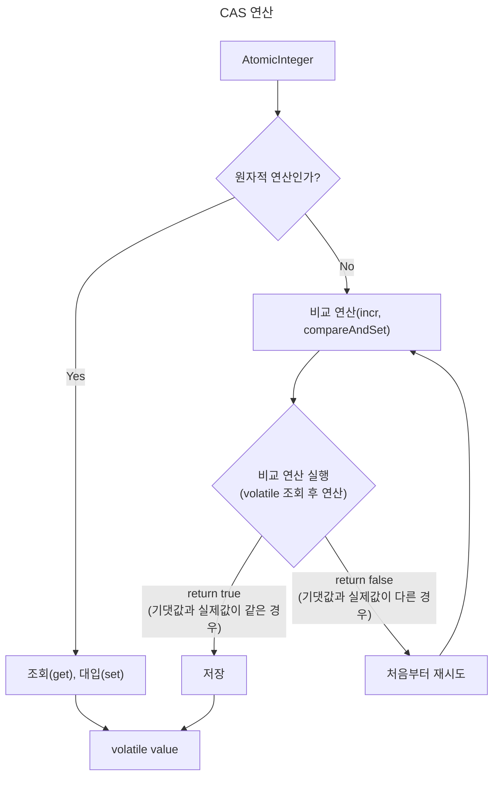

# CAS - 동기화와 원자적 연산

## 원자적 연산
컴퓨터 과학에서 사용하는 **원자적 연산**(atomic operation)의 의미는 해당 연산이 더 이상 나눌 수 없는 단위로 수행된 다는 것을 의미

> 예시와 함께 알아보자

| 구분  |                     구현                      |         성능         | 원자성 보장  |                               추가 설명                               |
|:---:|:-------------------------------------------:|:------------------:|:-------:|:-----------------------------------------------------------------:|
| BasicInteger |     int 형 타입 value `synchronized` 미사용      |       가장 빠름        | X |                          단일 스레드에서만 사용 가능                          |
| VolatileInteger | `volatile` int 형 타입 value `synchronized` 미사용 |         느림         | X |                     연산을 위한 안전한 임계 영역이 존재하지 않음                     |
| SyncInteger |      int 형 타입 value `synchronized` 사용      |       가장 느림        | O |                           안전한 임계 영역 존재                            |
| MyAtomicInteger |              `AtomicInteger` 사용               | synchronized 보다 빠름 | O | `synchronized` , `Lock(ReentrantLock)` 을 사용하는 경우보다 1.5 ~ 2배 정도 빠름 |

락 기반(`synchronized`, `Lock`)의 경우 안전한 임계 영역이 존재하지 하지만, 값을 조회하고, 수정할 때 락 취득을 위한 코스트가 발생

락 프리(`Atomic`) 기법은 CAS(Compare-And-Swap, Compare-And-Set) 연산 기반으로 락을 사용하지 않고 원자적 연산을 지원
- CAS 연산은 락을 완전히 대체하는 것은 아니고, CPU 하드웨어 기반으로 **작은 단위의 일부 영역에 적용**

 

## Atomic 클래스
### 동작

> CAS를 통해 스핀락(Spin Lock)을 구현하는 경우 `compareAndSet` 메서드 활용
> 
> Spin Lock은 락을 획득할 때까지 계속 반복문을 돌면서 대기하기 때문에 락 취득을 위해 대기하는 시간이 길어지는 경우(e.g. CPU 연산이 오래 걸리는 경우) 성능 저하가 발생할 수 있음 (CPU 자원 계속해서 소모)

스레드가 락을 획득하기 위해 대기하지 않기 때문에 대기 시간과 오버헤드가 줄어들기 때문에 성능 향상

충돌(연산 시 기댓값과 실제값이 다른 경우)이 빈번하게 발생하는 환경에서는 성능에 문제가 될 수 있음
- 여러 스레드가 자주 동시에 동일한 변수의 값을 변경하려고 시도할 때, CAS는 자주 실패하고 재시도해야 하므로 성능 저하가 발생할 수 있음
- 이런 상황에서는 반복문을 계속 돌기 때문에 CPU 자원을 많이 소모하게 됨

간단한 CPU 연산에는 락(Lock)보다는 CAS를 사용하는 것이 효과적

 

### 비교

| 구분 | 동기화 락(Lock) 방식                                                                                                         | CAS(Compare-And-Swap) 방식                                                                                                                        |
|:---:|:-----------------------------------------------------------------------------------------------------------------------|:------------------------------------------------------------------------------------------------------------------------------------------------|
| 접근 방법 | 비관적(pessimistic) 접근법 (다른 스레드가 방해할 것이다)                                                                              | 낙관적(optimistic) 접근법 (대부분의 경우 충돌이 없을 것이다)                                                                                                     |
| 설명 | 데이터에 접근하기 전에 항상 락을 획득 다른 스레드의 접근을 막음                                                                                | 락을 사용하지 않고 데이터에 바로 접근 충돌이 발생하면 그 때 재시도                                                                                                       |
| 장점 | 충돌 관리: 하나의 스레드만 리소스에 접근할 수 있으므로 충돌 발생 X  안정성: 복잡한 상황에서도 일관성 있는 동작 보장  CPU 절약: 락을 대기하는 스레드는 CPU를 거의 사용하지 않음 | 낙관적 동기화: 락을 걸지 않고도 값을 안전하게 업데이트  충돌이 적은 경우 성능 향상: 락 프리(Lock-Free) 기반으로 락을 사용하지 않기 때문에 락을 획득하기 위해 대기하는 시간 X                                |
| 단점 | 락 획득 대기 시간 증가: 스레드가 락을 획득하기 위해 대기해야 하므로 대기 시간이 길어질 수 있음  컨텍스트 스위칭 오버헤드: 락을 사용하면 락 획득을 대기하는 시점과 또 락을 획득하는 시점에 스레드의 상태가 변경되어 컨텍스트 스위칭이 발생할 수 있음 | 충돌이 빈번한 경우 성능 저하: 여러 스레드가 동시에 동일한 변수에 접근하여 업데이트를 시도할 때 충돌이 발생할 수 있음  스핀 락과 유사한 오버헤드: 충돌 시 반복적인 재시도를 하므로, 이 과정이 계속 반복되면 스핀 락과 유사한 성능 저하 발생 |

 

### 요약
일반적으로 동기화 락을 사용하고, 아주 특별한 경우에 한정해서 CAS를 사용해서 최적화해야 함
- 빨리 끝나거나 단순한 연산(e.g. 카운트)에서는 CAS를 사용하는 것이 효과적
- 오래 걸리거나 복잡한 연산(e.g. DB I/O 작업, Network I/O 작업)에서는 동기화 락 사용

우리가 일반적으로 사용하는 많은 자바 동시성 라이브러리 및 동기화 컬렉션들은 성능 최적화를 위해 CAS 연산을 적극 활용하고 있음
- 따라서 실무에서 직접 CAS 연산을 사용하는 사용하는 일은 매우 드뭄
- 대신에 CAS 연산을 사용해서 최적화 되어 있는 라이브러리들을 이해하고 편리하게 사용할 줄 알면 충분함