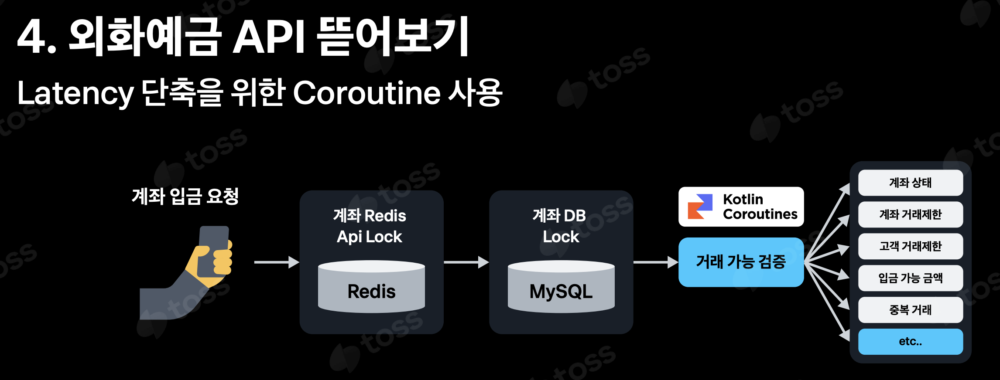

# 멀티 스레드(or Coroutine)를 이용한 계좌 이상 여부 확인

## 배경
이번 Toss SLASH 24에서 `Next 코어뱅킹, MSA와 MySQL로 여는 평생 무료 환전 시대` 세션 중 외환예금 API 구현에 대한 소개가 있었습니다.

세션 내용 중에는 입금 작업을 수행할 때 Latency를 단축하기 위해 여러 가지 장치를 도입했다는 것을 알 수 있는데요.

그 중에는 안전한 거래를 위해 필수적으로 수반되어야 하는 '거래 가능 여부를 검증' 작업을 동시에 처리하여 낮은 Latency로 처리하기 위해 코루틴을 통해 처리했다는 것을 알 수 있습니다.

그래서 이러한 작업을 단일 스레드 내에서 처리할 때와 멀티 스레드 또는 코루틴을 통해 병렬적으로 처리했을 때 얼마나 처리량이 차이나는지 확인해보고자 합니다.

 

## 목표
본 프로젝트에서는 멀티 스레드(또는 코루틴)을 통한 구현 예시와 함께 로컬 환경에서 가볍게 부하를 주었을 때 처리량이 어느 정도 차이가 나는지 정도를 확인할 예정입니다.

멀티 스레드(또는 코루틴)를 활용했을 때의 CPU 및 메모리 최적화 등 극한의 튜닝은 내용에 포함하지 않습니다.

