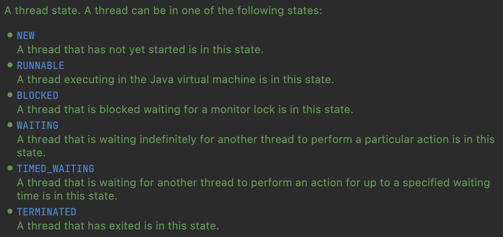

# 스레드 제어와 생명주기

## 스레드 정보
`Thread` 클래스에서 제공하는 메서드를 이용하여 스레드의 정보를 확인할 수 있음

```java
public class ThreadInfoMain {

    public static void main(String[] args) {
        // main 스레드
        Thread mainThread = Thread.currentThread();
        log("mainThread = " + mainThread);
        log("mainThread.threadId()=" + mainThread.threadId());
        log("mainThread.getName()=" + mainThread.getName());
        log("mainThread.getPriority()=" + mainThread.getPriority());
        log("mainThread.getThreadGroup()=" + mainThread.getThreadGroup());
        log("mainThread.getState()=" + mainThread.getState());

        // myThread 스레드
        Thread myThread = new Thread(new HelloRunnable(), "myThread");
        log("myThread = " + myThread);
        log("myThread.threadId()=" + myThread.threadId());
        log("myThread.getName()=" + myThread.getName());
        log("myThread.getPriority()=" + myThread.getPriority());
        log("myThread.getThreadGroup()=" + myThread.getThreadGroup());
        log("myThread.getState()=" + myThread.getState());
    }
}
```

<br>

## 스레드 생명주기




|      상태      | 설명 | 상태 전이                                                                                                                                                                                                                                              |
|:------------:|:---|:---------------------------------------------------------------------------------------------------------------------------------------------------------------------------------------------------------------------------------------------------|
|     NEW      | 스레드가 생성되었으나 아직 시작되지 않은 상태 | • NEW → RUNNABLE: `start()` 호출                                                                                                                                                                                                                     | 
|   RUNNABLE   | 스레드가 실행 중이거나 실행될 준비가 된 상태 | • RUNNABLE → BLOCKED: 스레드가 lock을 얻지 못한 경우<br><br/>• RUNNABLE → WAITING: `wait()` , `join()` 호출<br><br/>• RUNNABLE → TIMED_WAITING: `sleep(long millis)` , `wait(long timeout)` , `join(long millis)` 호출<br><br/>• RUNNABLE → TERMINATED: 스레드 실행 완료 | 
|   BLOCKED    | 스레드가 동기화 락을 기다리는 상태 | • BLOCKED → RUNNABLE: lock 얻은 경우                                                                                                                                                                                                                   |
|   WAITING    | 스레드가 무기한으로 다른 스레드의 작업을 기다리는 상태 | • WAITING → RUNNABLE: `notify()` 또는 `notifyAll()` 호출, `join()` 이 완료될 때                                                                                                                                                                             |
| TIMED_WATING | 스레드가 일정 시간 동안 다른 스레드의 작업을 기다리는 상태 | • TIMED_WATING → RUNNABLE: 설정한 시간 경과 후                                                                                                                                                                                                            |
|  TERMINATED  | 스레드의 실행이 완료된 상태 |                                                                                                                                                                                                                                                    |


## join()
특정 스레드가 완료될 때 까지 기다려야 하는 상황에서 사용
- 특정 스레드의 작업이 완료될 때까지 기다리는 작업을 `sleep()`을 통해서 구현하면 정확한 종료 시점을 예측할 수 없음
- `join()`을 사용하면 특정 스레드가 종료될 때까지 기다릴 수 있음

다만 단순히 `join()`을 사용하면 다른 스레드가 완료될 때까지 무기한 기다림
- 이러한 경우 `join(long millis)`를 사용하여 타임아웃을 지정할 수 있음


## interrupt(), isInterrupted(), interrupted()
특정 스레드의 작업을 중간에 중단하는 방법
- 가장 쉬운 방법은 변수로 flag를 설정하여 스레드가 종료되도록 하는 방법
- 스레드 내부에서 flag를 확인하기 때문에 스레드 내 로직(e.g. `sleep()`) 또는 flag 검사 주기에 따라 바로 종료되지 않을 수 있음

WAITING, TIMED_WAITING 상태의 스레드를 직접 깨워서 RUNNABLE 상태로 전환시키는 방법
- 예를 들어 `sleep()`에 의해 TIMED_WAITING 상태에 있는 스레드를 깨우기 위해 `interrupt()`를 호출하면 아래 동작 실행
  - `InterruptedException` 발생
    - `interrupt()` 를 호출했다고 해서 즉각 `InterruptedException` 이 발생하는 것은 아님
    - `sleep()`처럼 `InterruptedException`을 던지는 메서드가 호출 또는 실행될 때 예외가 발생
  - TIMED_WAITING 상태에서 RUNNABLE 상태로 전이
  - catch 블록 내 코드가 실행 (RUNNABLE 상태여야 catch 블록 내 코드가 실행될 수 있음)
- interrupt 상태는 `interrupt()`를 호출 시 `true`로 변경되고, `InterruptedException`이 발생하면 `false`로 변경됨

`InterruptedException`에 대한 catch 구문으로만 스레드를 중단하는 경우 `InterruptedException`을 던지지 않는 부분(e.g. log 출력)은 그대로 실행되고 다음 코드로 진행
- 더욱 빠르게 작업을 중단하고 싶다면 `Thread.interrupted()`를 통해 인터럽트 상태를 확인하여 스레드를 종료할 수 있음
  - 인터럽트 상태인 경우 `true`를 반환하고, 인터럽트 상태를 `false`로 변경
  - 인터럽트 상태가 아닌 경우 `false`를 반환, 인터럽트 상태 변경 없음
- 만약 `isInterrupted()` 값을 통해 스레드의 인터럽트 상태를 확인하여 스레드를 종료하는 경우 `InterruptedException`이 발생하지 않기 때문에 인터럽트 상태가 변경되지 않음 (`isInterrupted()` = true)
  - 이 경우 인터럽트 상태이기 때문에 이후 코드에서 `sleep()`처럼 `InterruptedException`을 던지는 메서드가 실행되면 해당 위치에서 기대하지 않았던 `InterruptedException`이 발생할 수 있음

```java
public class ThreadStopMainV4 {

  public static void main(String[] args) {
    MyTask task = new MyTask();
    Thread thread = new Thread(task, "work");
    thread.start();

    sleep(100); // 시간을 줄임
    log("작업 중단 지시 thread.interrupt()");
    thread.interrupt();
    log("work 스레드 인터럽트 상태1 = " + thread.isInterrupted());
  }

  static class MyTask implements Runnable {

    @Override
    public void run() {
      // while (!Thread.currentThread().isInterrupted()) { // 인터럽트 상태 변경X
      while (!Thread.interrupted()) { // 인터럽트 상태 변경O
        log("작업 중");
      }
      log("work 스레드 인터럽트 상태2 = " + Thread.currentThread().isInterrupted());

      try {
        log("자원 정리");
        Thread.sleep(1000);
        log("자원 종료");
      } catch (InterruptedException e) {
        log("자원 정리 실패 - 자원 정리 중 인터럽트 발생");
        log("work 스레드 인터럽트 상태3 = " + Thread.currentThread().isInterrupted());
      }
      log("작업 종료");
    }
  }
}
```

## yield
스레드의 상태를 유지(RUNNABLE 상태)하면서 다른 스레드에게 CPU를 양보(OS에 힌트를 제공)하는 메서드
- `sleep()`을 사용하는 경우 `RUNNABLE` → `TIMED_WAITING` → `RUNNABLE`로 상태가 전이되는 과정을 거치고, 특정 시간동안 스레드가 실행되지 않음
- 반면 `yield()`를 사용하는 경우 `RUNNABLE` 상태로 유지(스케줄링 큐 대기)되고, 다른 스레드에게 CPU를 양보하고 다시 스케줄링 큐에 들어가서 CPU를 할당받음

만약 무의미한 작업이 반복돼서 CPU를 점유하는 경우 `yield()`를 호출을 통해 다른 스레드에게 CPU를 양보하여 성능을 향상시킬 수 있음