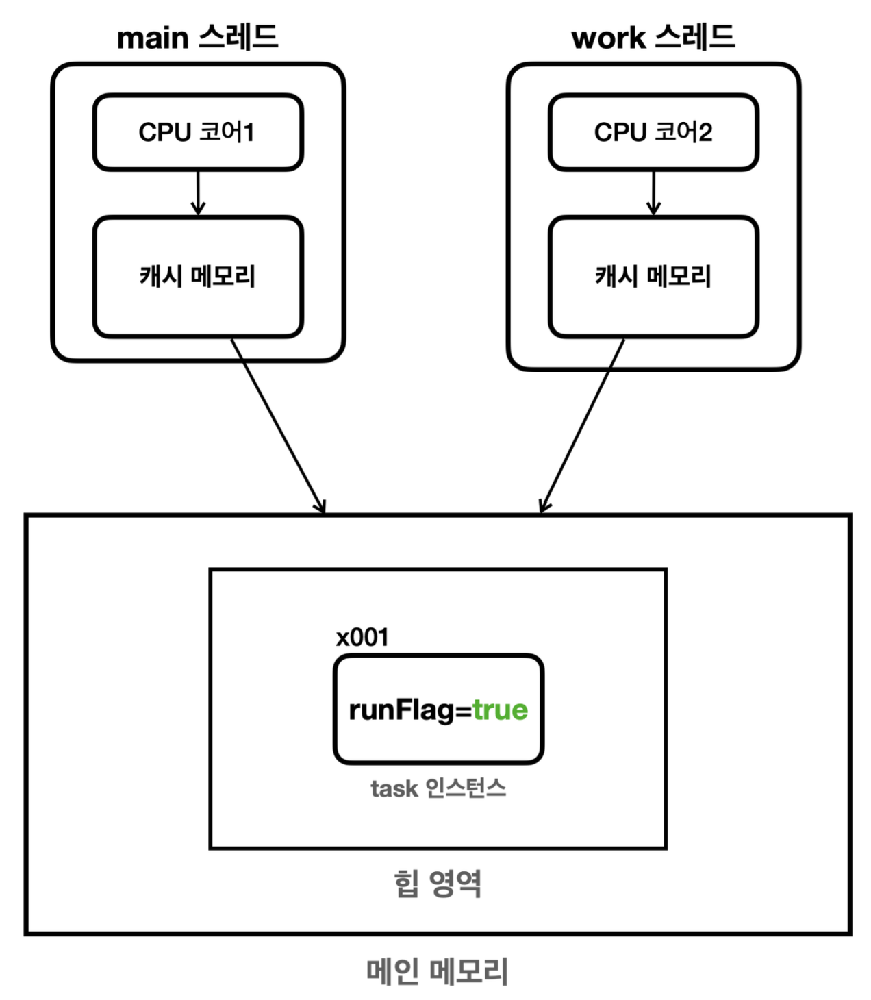
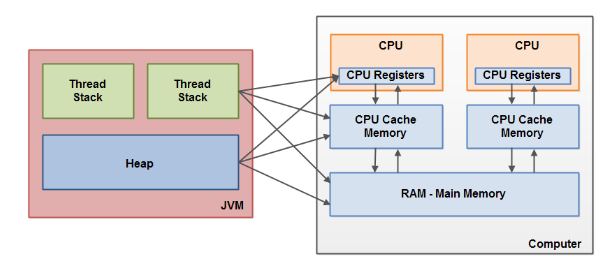

# Volatile
`volatile` 키워드는 자바에서 멀티 스레드 환경에서 변수의 값을 읽거나 쓸 때 해당 변수의 값을 쓰는 쓰레드에서 캐시를 사용하지 않고 항상 메인 메모리에서 읽거나 쓰도록 보장함 

이를 통해 변수에 대한 변경이 다른 쓰레드에 즉시 반영되도록 함

## 메모리 가시성 문제

>  멀티 스레드 환경에서 한 스레드가 변경한 값이 다른 스레드에서 언제 보이는지에 대한 문제



`main` 스레드와 `work` 스레드는 각각의 CPU 코어에 할당되어서 실행, CPU 코어가 1개라면 빠르게 번갈아 가면서 실행될 수 있음
- 단순히 생각해보면 메인 메모리에 저장된 `runFlag` 값을 개별 스레드에서 읽어서 사용할 것으로 생각할 수 있음

하지만 멀티 코어 프로세서에서는 코어가 2개이상이며 각각의 코어는 모두 메모리에서 읽어온 값을 캐시에 저장하고, 값을 읽어서 작업함 (CPU 처리 성능 향상 목적)
- 다시 같은 값을 읽어올 때는 캐시에 있는지 확인하고 없을 때만 메모리에서 가져옴

따라서 메모리에 저장된 변수의 값이 변경되었는데도 캐시에 저장된 값이 갱신되지 않아서 변수의 값이 다른 경우가 발생할 수 있음

이 때에는 `volatile` 키워드를 사용하여 변수를 선언하면 캐시를 사용하지 않고 항상 메인 메모리에서 읽거나 쓰도록 보장할 수 있음

```java
volatile boolean runFlag = true;
```

<br>

### 메모리 갱신 시점
그렇다면 캐시 메모리에 반영한 값은 언제 메인 메모리로 갱신되는가?
- CPU 설계 방식과 종류의 따라 다르기 때문에 알 수 없음

다만 주로 컨텍스트 스위칭이 될 때, 캐시 메모리도 함께 갱신됨 (물론 이 부분도 환경에 따라 달라질 수 있음)
- `Thread.sleep()` , 콘솔에 출력등을 할 때 스레드가 잠시 쉬는데, 이럴 때 컨텍스트 스위칭이 되면서 주로 갱신될 수 있음
- 하지만 이것이 갱신을 보장하는 것은 아님

그렇기 때문에 확실하게 메모리 가시성 문제를 해결하기 위해서는 `volatile` 키워드를 사용하는 것이 좋음


<br>

## 메모리 가시성과 volatile

### 배경
JVM에서는 하드웨어 메모리에 아래와 같은 구조로 접근하게 됨
- 동일한 변수여도 CPU 코어마다 별도 캐시 메모리를 통해 작업을 처리하기 때문에 메모리 가시성 문제가 발생할 수 있음



### 해결
메모리 가시성 문제가 발생할 수 있는 경우 `volatile` 키워드를 통해 방지
- 데이터를 Read할 때마다 CPU cache에 저장된 값이 아닌 Main Memory에서 Read
- 데이터를 Write할 때마다 Main Memory에 Write

<br>

### 장점
멀티스레드 환경에서 가시성을 보장하여 데이터의 일관성을 유지할 수 있음

### 단점
가시성은 보장하지만 원자성은 보장하지 않음
- long, double 타입처럼 JVM 기본 데이터 처리 단위(4 bytes)보다 큰 데이터 타입에 대해 작업하는 것을 원자화할 수 있음
- 다만 비교 연산 등 여러 스레드가 동시에 쓰기 작업을 수행하는 경우에 대해 원자성을 보장하지 못함

항상 메인 메모리와 동기화 해야 하므로 캐시로 인한 성능 항상을 기대할 수 있음 (성능 저하 요인)

### 그러면?
`volatile`을 직접 사용하기 보다는 `Atomic` 타입을 활용해서 처리
- 어차피 내부에 `volatile`을 사용하고 있음
- 현재 스레드에 저장된 값과 메인 메모리에 저장된 값을 비교 (추후 정리할 CAS 알고리즘에서 자세히 설명)

`Atomic` 타입의 경우 내부에서 비교/연산이 필요한 경우 스레드 및 메모리 값을 비교하여 처리하고, get/set 메소드는 원자성 문제가 발생하지 않는 메서드는 단순히 `volatile` 변수를 활용하여 처리

<br><br>

## 자바 메모리 모델 (Java Memory Model)
Java Memory Model(JMM)은 자바 프로그램이 어떻게 메모리에 접근하고 수정할 수 있는지를 규정
- 특히 멀티 스레드 프로그래밍에서 스레드 간의 상호작용을 정의

자바 메모리 모델에서 스레드 간의 작업 순서를 정의하는 개념인 `happens-before` 관계에 대한 정의를 포함

- `happens-before` 관계는 이름 그대로, 한 동작이 다른 동작보다 먼저 발생함을 보장
- `happens-before` 관계가 성립하면 한 스레드의 작업을 다른 스레드에서 볼 수 있음
  - 한 스레드에서 수행한 작업을 다른 스레드가 참조할 때 최신 상태를 보장

이러한 규칙을 통해 멀티 스레드 환경에서의 예상치 못한 동작을 방지할 수 있음