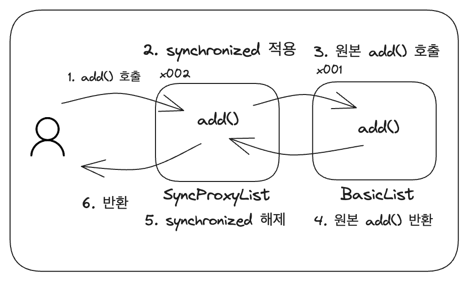

# 섹션12. 동시성 컬렉션

## 동시성 컬렉션이 필요한 이유

스레드 세이프(Thread Safe): 여러 스레드가 동시에 접근해도 괜찮은 경우

java.util 패키지에 있는 컬렉션 프레임 워크는 스레드 세이프 할까?

### java.util 패키지는 스레드 세이프 하지 않다.

```java
public void add(Object e) {
		elementData[size] = e;
		sleep(100); // 멀티스레드 문제를 쉽게 확인하는 코드
		size++;
}
```

이 메서드는 원자적이지 않다.

- 내부 배열에 데이터 추가
- size도 함께 하나 증가
    - size 값 불러오기
    - +1 하기

따라서 원자적이지 않은 연산을 멀티스레드 환경에서 사용하려면 `synchronized` 혹은 `Lock` 을 통해 동기화 해야함

## 프록시 도입

### 프록시(Proxy): 대리자, 대신 처리해주는 자



- 프록시인 SyncProxyList는 원본인 BasicList와 똑같은 SimpleList 구현
    - 클라이언트는 원본 구현체든 proxy 구현체는 상관 X
- 클라이언트 입장에서는 프록시든 원본이든 똑같은 SimpleList 구현체
- 프록시는 내부에 원본을 가지고 있음
    - 필요한 일을 처리 한 후, 원본을 호출하는 구조로 구현 가능
        - 여기서는 Synchronized 블럭을 감싸는 일을 함
- 프록시가 동기화 적용 됐으므로, 원본 코드도 동기화 적용됨

### 프록시 패턴

객체지향 디자인 패턴 중 하나

> 어떤 객체에 대한 접근을 제어하기 위해 그 객체의 대리인 또는 인터페이스 역할을 하는 객체 제공
> 
- 접근 제어: 실제 객체에 대한 접근 제어 및 통제
- 성능 향상: 실제 객체의 생성을 지연 or 캐싱하여 성능 최적화
- 부가 기능 제공: 실제 객체에 추가적인 기능(로깅, 인증, 동기화 등)을 투명하게 제공

Ex) Spring AOP

## 자바 동시성 컬렉션 - synchronized

모든 자료구조에 `synchronized` 를 사용해 동기화 해두면 어떨까 싶지만

- 모든 동기화 방식은 성능과 트레이드 오프가 있다

결국 개발자가 정확히 필요성을 판단하고 필요한 경우에만 적용해야 한다.

### Collections.synchronizedList(new ArrayList<>());

```java
 public static <T> List<T> synchronizedList(List<T> list) {
     return new SynchronizedRandomAccessList<>(list);
}
```

SynchronizedRandomAccessList는 synchronized를 추가하는 프록시 역할 수행

- 클라이언트 → ArrayList
- 클라이언트 → SynchronizedRandomAccessList(프록시) → ArrayList

### 단점

- 동기화 오버헤드 발생
    - 락을 사용하기 때문에 성능 저하가 발생할 수 밖에 없음
- 전체 컬렉션에 대해 동기화
    - 잠금 경합이 증가하여 병렬 처리의 효율성 저하
    - 특정 스레드가 컬렉션을 사용하면 다른 스레드는 대기해야함
- 정교한 동기화 불가능
    - 컬렉션 전체에 synchronized를 걸기 때문에 동기화에 대한 최적화 불가능

## 자바 동시성 컬렉션 - 동시성 컬렉션

동시성 컬렉션: thread-safe한 컬렉션, 매우 정교한 매커니즘으로 효율적으로 처리

### 동시성 컬렉션의 종류

- List
    - CopyOnWriteArrayList → ArrayList의 대안
- Set
    - CopyOnWriteArraySet → HashSet의 대안
    - ConcurrentSkipListSet → TreeSet의 대안(정렬된 순서 유지, Comparator 사용 가능)
- Map
    - ConcurrentHashMap → HashMap의 대안
    - ConcurrentSkipListMap → TreeMap의 대안(정렬된 순서 유지, Comparator 사용 가능)
- Queue
    - ConcurrentLinkedQueue → 동시성 큐, 비 차단(non-blocking)큐
- Deque
    - ConcurrentLinkedDeque → 동시성 데크, 비 차단(non-blocking)큐

### 스레드를 차단하는 블로킹 큐

- BlockingQueue
    - ArrayBlockingQueue
        - 크기가 고정된 블로킹 큐
        - 공정(fair)모드 사용 가능, 사용 시 성능 저하
    - LinkedBlockingQueue
        - 크기가 무한하거나 고정된 블로킹 큐
    - PriorityBlockingQueue
        - 우선순위가 높은 요소를 먼저 처리하는 블로킹 큐
    - SynchronousQueue
        - 데이터를 저장하지 않는 블로킹 큐, 생산자가 데이터 추가 시 소비할 때 까지 대기
        - 생산자 - 소비자 직접거래
    - DelayQueue
        - 지연된 요소를 처리하는 블로킹 큐
        - 각 요소는 지정된 시간이 지난 후 소비 가능