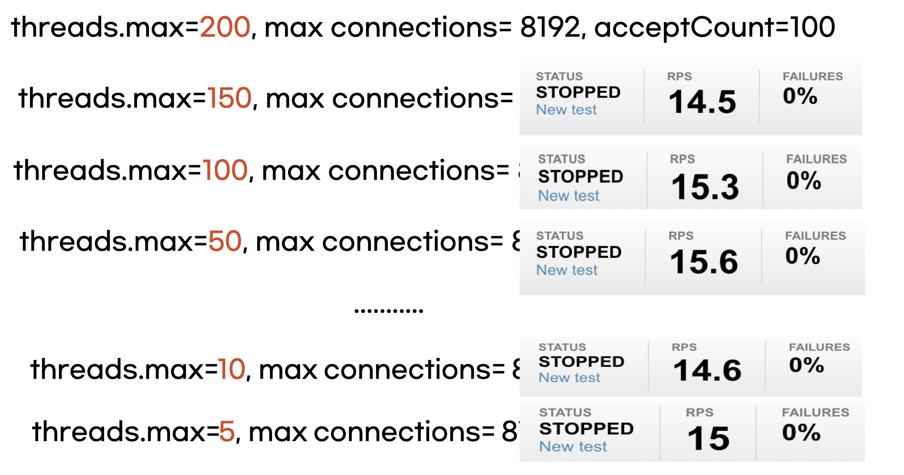
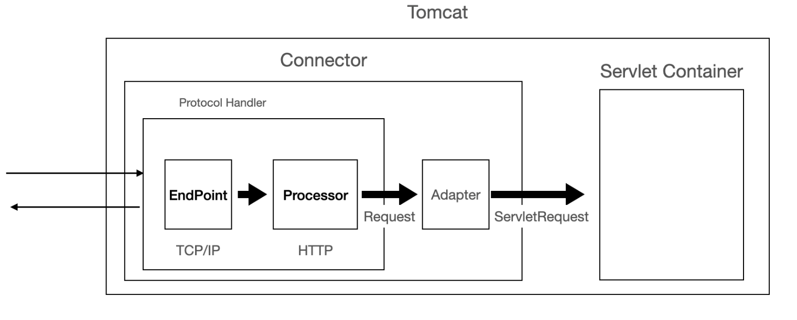
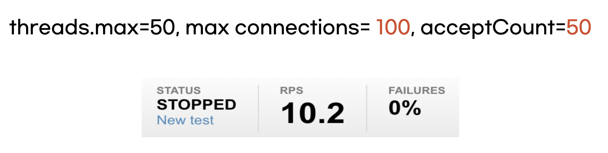

## Appendix

Ref. [https://velog.io/@myspy/스프링부트-스레드](https://velog.io/@myspy/%EC%8A%A4%ED%94%84%EB%A7%81%EB%B6%80%ED%8A%B8-%EC%8A%A4%EB%A0%88%EB%93%9C)

Ref. [https://velog.io/@hyunjong96/Spring-NIO-Connector-BIO-Connector](https://velog.io/@hyunjong96/Spring-NIO-Connector-BIO-Connector)

### Spring의 thread pool

- Spring boot가 아닌 Tomcat에서 다중 요청을 처리
- Tomcat이 다중 요청을 처리하기 위해, 부팅 시 Thread Pool을 생성
- 앞에서 언급한 멀티코어 스케줄링처럼 유저 요청이 들어오면 Thread Pool에서 Thread를 하나씩 할당하고, 해당 Thread에서 Dispathcer Servlet을 거쳐 요청을 처리한다.
- 작업을 끝내면 Thread는 Thread Pool로 반환

### Spring boot & Tomcat

application.yml에서 Tomcat의 설정을 바꾸어 적용할 수 있다.

```yaml
server:
	tomcat:
		threads:
			max: {생성할 thread의 총 갯수}
			min-spare: {항상 활성화 할(idle) thread의 갯수}
		max-connections: {동시에 처리할 수 있는 connection의 갯수}
		accept-count: {작업큐의 사이즈}
		connection-timeout: {timeout 기준 시간}
```

참고 : Spring boot에선 accept-count 옵션을 설정하지 않으면 Integer.max 값을 할당

→ 이는 무한 대기열 전략으로 많은 요청이 들어와도 core size를 늘리지 않는 정책이다.

→ 서버에서 설정한 최대 스레드 수 이상의 요청이 들어와도 추가로 스레드를 생성하지 않고 대기열에 추가하는 정책

### threads.max & max connections & accept-count

threads.max(생성 할 스레드의 갯수) & max connections(동시에 처리할 수 있는 connection의 갯수) & accept-count(작업큐의 사이즈) 이 세가지 Tomcat 설정을 적절하게 변경하여 최적화 할 수 있다.



동시 접속자가 150이라고 가정한 후, max connections와 accept-count 값을 고정하고, threads.max 값 만을 변경하며 RPS의 변화를 테스트 한 결과

→ thread를 줄여도 RPS는 변화가 거의 없는 것을 볼 수 있음

### **왜?**



→ tomcat은 사용자의 요청을 처리하기 위해 Connector를 사용하는데 Connector에도 thread가 사용된다. (max-connections 설정이 이 Connector에 반영됨, 네트워크 연결 관리)

그리고 이 Connector는 Blocking I/O 방법을 사용하는 BIO Connector와 NonBlocking I/O 방법을 사용하는 NIO Connector가 있다.

그리고 톰캣 9.0 버전부터 BIO Connector가 삭제되어 현재에는 NIO Connector만 사용되고 있다.

즉, thread가 Non-Blocking I/O 방식으로 요청을 처리하기 때문에 하나의 thread가 여러 요청을 동시에 처리할 수 있게 되어 thread의 갯수를 줄여도 RPS가 변화가 없는 것



다음은 max connections를 줄였을 때의 결과

동시에 100개의 요청만을 처리하기 때문에 RPS 성능이 떨어진 것을 볼 수 있다.

→ 나머지 요청은 대기 큐에 쌓이기 때문에 성능이 저하된다.