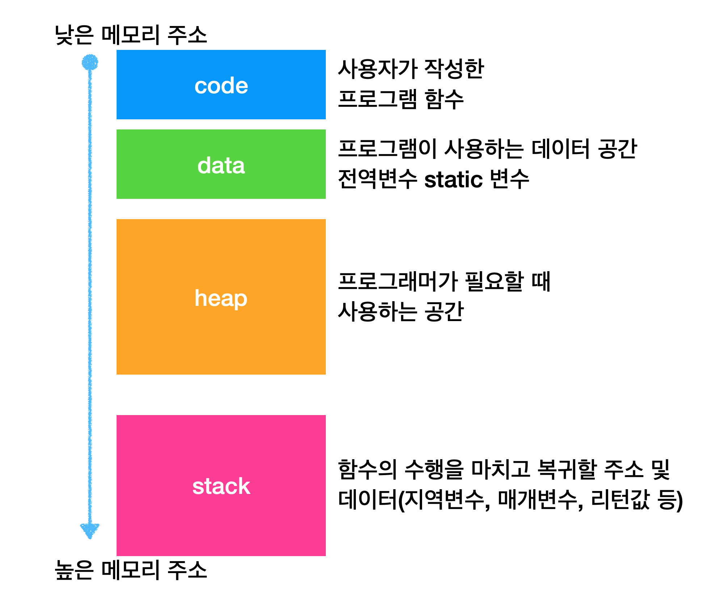

# 섹션 2. 프로세스와 스레드 소개

> ### 멀티태스킹

CPU가 매우 빠르게 두 프로그램의 코드를 번갈아 수행함 → 사람은 두 프로그램이 동시에 실행된다고 느낌

- 대략 10ms 단위로 돌아가며 실행

이렇게 각 프로그램의 실행 시간을 분할해서 마치 동시에 실행되는 것 처럼 하는 기법 → 시분할

CPU에 어떤 프로그램이 얼마만큼 실행 되는지는 운영체제가 결정 → 스케줄링

> ### 멀티 프로세싱

CPU 코어가 둘 이상이면?

- CPU 안에 실제 연산을 처리할 수 있는 코어가 존재

컴퓨터 시스템에서 둘 이상의 프로세서를 사용하여 여러 작업을 동시에 처리하는 기술

> ### 멀티 프로세싱 vs 멀티태스킹

멀티프로세싱은 하드웨어 장비의 관점, 멀티태스킹은 소프트웨어의 관점

멀티프로세싱

- 여러 CPU를 사용하여 동시에 여러 작업 수행
- 하드웨어 기반으로 성능 향상

멀티태스킹

- 단일 CPU가 여러 작업을 동시에 수행하는 것 처럼 보이게 하는 작업
- 소프트웨어 기반으로 CPU 시간을 분할하여 각 작업 할당

> ## 프로세스와 스레드

>> ### 프로세스

- 운영체제 안에서 실행중인 프로그램을 프로세스라 한다.
- 프로세스는 실행 중인 프로그램의 인스턴스이다.
- ex) 클래스 = 프로그램, 인스턴스 = 프로세스

프로세스는 별도의 메모리 공간을 갖고 있기 때문에 서로 간섭 X → 서로의 메모리에 직접 접근 불가능

즉, 하나의 프로세스가 충돌을 해도 다른 프로세스는 영향 X

프로세스의 메모리 구성

- 코드 섹션 : 실행할 프로그램의 코드
- 데이터 섹션 : 전역 변수 및 정적 변수가 저장되는 공간
- 힙 : 동적으로 할당되는 메모리 영역
- 스택 : 메서드 호출 시 생성되는 지역 변수 및 반환 주소가 저장되는 영역 (스레드에 포함)

>> ### 스레드

프로세스는 하나 이상의 스레드를 반드시 포함

프로세스가 제공하는 동일한 메모리 공간 공유

스레드의 메모리 구성

- 공유 메모리 : 같은 프로세스의 코드 섹션, 데이터 섹션, 힙은 프로세스 안의 모든 스레드 공유
- 개별 스택 : 각 스레드는 자신의 스택을 갖는다.

즉, 스레드는 스택 이외에는 다른 스레드와 메모리를 공유한다.

---

**프로그램이 실행된다는 것은?**

프로그램이 실행된다는 것은 사실 프로세스 안에 있는 코드가 한줄씩 실행되는 것

프로세스의 코드를 실행하는 흐름을 스레드라 한다.

→ 스레드는 프로세스 내에서 실행되는 작업의 단위

단일 스레드 ⇒ 1 프로세스 : 1 스레드

멀티 스레드 ⇒ 1 프로세스 : n 스레드

> ### 스레드와 스케줄링

프로세스 = 실행 환경과 자원을 제공하는 컨테이너

스레드 = 실제 CPU를 사용해서 코드를 하나하나 실행하는 것

>> ### 단일 코어 스케줄링

1. 운영체제는 내부에 스케줄링 큐를 보유, 각각의 스레드는 스케줄링 큐에 대기
2. 운영체제가 하나의 스레드를 꺼내고 CPU를 통해 실행
3. 운영체제가 해당 스레드를 잠시 멈추고 스케줄링 큐에 도로 넣어놓음
4. 운영체제는 다음 스레드를 큐에서 꺼내 CPU를 통해 실행

>> ### 멀티 코어 스케줄링

CPU 코어가 2개 이상이면 진짜 동시에 실행 가능

단일 코어 스케줄링을 CPU 두개가 한다고 생각하면 됨

> ## 컨텍스트 스위칭

스레드를 멈추는 시점에 CPU에서 사용하던 값들을 메모리에 저장하고, 추 후에 다시 실행 할 때 이 값들을 다시 CPU에 불러와야 한다.

이 과정을 **컨텍스트 스위칭**이라 한다.

실행 중이던 값을 메모리에 저장 → 다시 실행하기 위해 메모리에서 불러오기

이 과정에서 비용 발생

멀티스레드는 대부분 효율적이지만, 컨텍스트 스위칭 과정이 필요하므로 항상은 아니다.

> ### CPU 바운드 작업 vs I/O 바운드 작업

스레드가 하는 작업은 이 두개로 나눌 수 있다.

CPU 바운드 작업

- CPU의 연산 능력을 요구하는 작업
- 계산, 데이터 처리, 알고리즘 실행 같은 CPU의 처리속도가 작업 완료 시간 결정

I/O 바운드 작업

- 디스크, 네트워크 등 입출력 작업을 요구하는 작업
- I/O 작업이 완료될 때 까지 대기시간 발생, CPU는 상대적으로 대기 상태에 있는 경우가 많음
    - 즉, 스레드가 CPU 사용 X, I/O 다될때까지 대기

> ### 웹 애플리케이션 서버

**실무는 CPU 바운드 작업보다는 I/O 바운드 작업이 많다.**

실무에서는 성능 테스트를 통해서 최적의 스레드 숫자를 찾는 것이 이상적!

스레드의 숫자는 CPU 바운드 작업이 많은가, 아니면 I/O 바운드 작업이 많은가에 따라 다르게 설정해야 함

CPU 바운드 작업 : CPU 코어 수 + 1개

- CPU를 거의 100% 사용하는 작업이므로 CPU 숫자에 최적화

I/O 바운드 작업 : CPU 코어 수 보다 많은 스레드를 생성, CPU를 최대한 사용할 수 있는 숫자까지 스레드 생성

- 성능 테스트를 통해 CPU를 최대한 활용하는 숫자까지 스레드 생성