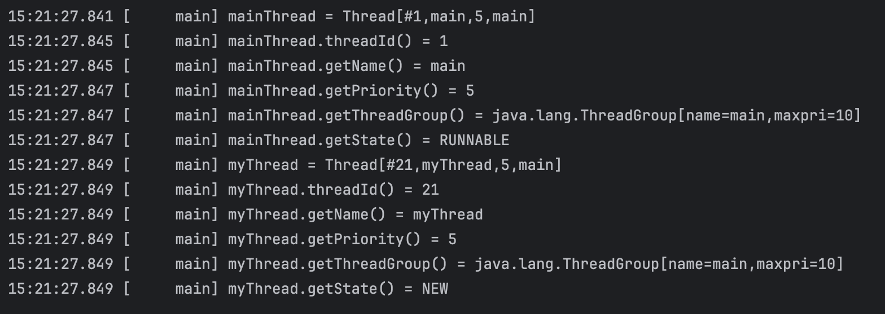
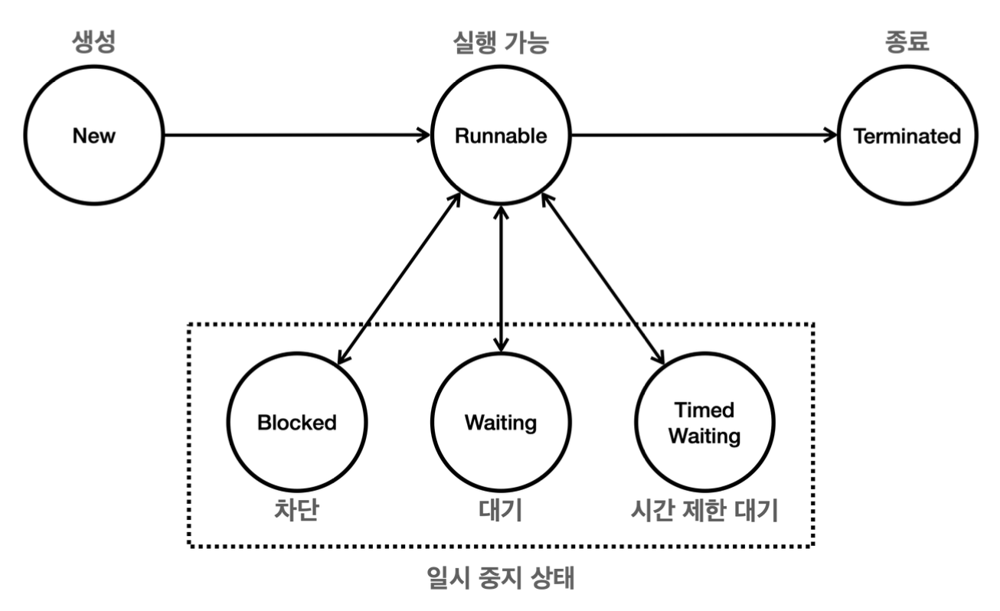
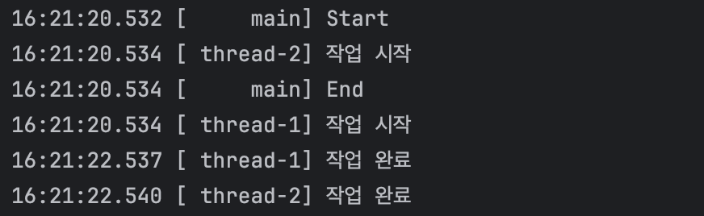
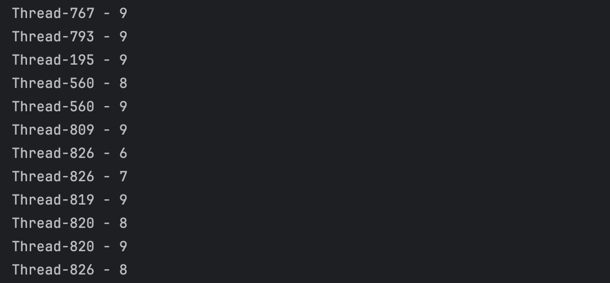

# 섹션 4~5. 스레드 제어와 생명 주기

## 스레드 기본 정보

Thread 클래스는 스레드의 정보 역시 확인할 수 있는 메서드를 제공한다.

```java
import thread.start.HelloRunnable;
import static util.MyLogger.log;

public class ThreadInfoMain {
    public static void main(String[] args) {
        // main 스레드
        Thread mainThread = Thread.currentThread();
        log("mainThread = " + mainThread);
        log("mainThread.threadId() = " + mainThread.threadId());
        log("mainThread.getName() = " + mainThread.getName());
        log("mainThread.getPriority() = " + mainThread.getPriority()); // 1~10(기본값 5)
        log("mainThread.getThreadGroup() = " + mainThread.getThreadGroup());
        log("mainThread.getState() = " + mainThread.getState());

        // myThread 스레드
        Thread myThread = new Thread(new HelloRunnable(), "myThread");
        log("myThread = " + myThread);
        log("myThread.threadId() = " + myThread.threadId());
        log("myThread.getName() = " + myThread.getName());
        log("myThread.getPriority() = " + myThread.getPriority());
        log("myThread.getThreadGroup() = " + myThread.getThreadGroup());
        log("myThread.getState() = " + myThread.getState());
    }
}
```



출력 결과를 보면 mainThread는 실행중이므로 RUNNABLE 상태이고,

myThread는 생성만 되고 실행은 안되고 있으므로 NEW 상태

## 스레드의 생명 주기



### 스레드의 상태

| **상태**                      | **설명**                                                                                       |
|-------------------------------|----------------------------------------------------------------------------------------------|
| **New**                       | 스레드가 생성되었지만 `start()` 메서드가 호출되지 않은 상태                                      |
| **Runnable**                  | 실행 중이거나 실행 준비가 완료된 상태 (`start()` 호출 후 CPU 할당 대기)                            |
| **Blocked**                   | `synchronized` 블록에 진입하기 위해 락을 대기하는 상태                                           |
| **Waiting**                   | `wait()`, `join()` 호출로 다른 스레드 작업을 무기한 대기하는 상태                                |
| **Timed Waiting**             | `sleep()`, `wait(timeout)`, `join(timeout)`으로 일정 시간 동안 대기하는 상태                      |
| **Terminated**                | 스레드가 실행을 완료하고 종료된 상태                                                            |


## 체크 예외 재정의

Runnable 인터페이스의 run() 메서드를 구현할 때 `InterruptedException` 체크 예외를 밖으로 던질 수 없는 이유

```java
 public interface Runnable {
     void run();
}
```

자바에서 메서드를 재정의 할 때, 지켜야할 예외와 관련된 규칙

- 체크 예외
    - 부모 메스더가 체크 예외를 던지지 않는 경우, 재정의된 자식 메서드도 던질 수 없다.
    - 자식 메서드는 부모 메서드가 던질 수 있는 체크 예외의 하위 타입만 던질 수 있다.
- 언체크(런타임) 예외
    - 예외 처리를 강제하지 않으므로 상관없이 던질 수 있음

> Runnable 인터페이스의 run() 메서드는 아무런 체크 예외를 던지지 않으므로 재정의 하는 곳 역시 체크 예외를 밖으로 던질 수 없다.

## join

join() 메서드를 통해 WAITING(특정 작업 무기한 대기 상태) 알아보기



스레드를 여러개 만들고 실행하게 되면 위의 결과와 같이 실행 순서를 보장하지 않는다.

메인 스레드가 가장 먼저 끝나버렸는데 다른 모든 스레드가 끝나고 메인 스레드를 끝내고 싶다면?

→ 이를 위해 join()을 사용

```java
thread1.join();
thread2.join();
```

join()을 사용하면, main 스레드는 두 스레드들이 종료될 때 까지 `WAITING` 상태에 들어간다.

그리고, 두 스레드가 `TERMINATED` 상태가 되면 다시 `RUNNABLE` 상태가 되어 다음 코드를 실행한다.

> **즉, join()은 특정 스레드가 완료 될 때 까지 기다려야 할 때 사용**

### 번외

join(ms)를 사용하게 되면 스레드가 다른 스레드를 무기한으로 기다리지 않고, 특정 시간만큼만 기다림

이때, 대기하는 스레드는 `TIMED_WAITING`  상태에 들어감

그리고, 두 스레드가 `TERMINATED` 상태가 되거나 `time out`이 되면, 다시 `RUNNABLE` 상태가 되어 다음 코드를 실행한다.

## interrupt

특정 스레드의 작업을 중간에 중단

인터럽트를 사용하면 `WAITING` `TIMED_WAITING` 같은 대기 상태의 스레드를 직접 깨워 `RUNNABLE` 로 만들 수 있다.

```java
public class ThreadStopMainV2 {
    public static void main(String[] args) {
        MyTask task = new MyTask();
        Thread thread = new Thread(task, "work");
        thread.start();
        sleep(4000);
        log("작업 중단 지시 thread.interrupt()"); thread.interrupt();
        log("work 스레드 인터럽트 상태1 = " + thread.isInterrupted());
    }
    static class MyTask implements Runnable {
        @Override
        public void run() {
            try {
                while (true) {
                    log("작업 중");
                    Thread.sleep(3000);
                }
            } catch (InterruptedException e) { log("work 스레드 인터럽트 상태2 = " +
                    Thread.currentThread().isInterrupted());
                log("interrupt message=" + e.getMessage());
                log("state=" + Thread.currentThread().getState());
            }
            log("자원 정리");
            log("작업 종료"); }
    }
}
```

> 특정 스레드의 인스턴스에 **interrupt()** 메서드를 호출하면, 해당 스레드에 인터럽트가 발생

-  해당 스레드는 인터럽트 상태(true)가 됨

- 해당 스레드가 대기중이었다면 `InterruptException` 이 발생

  -  해당 스레드는 대기 상태에서 `RUNNABLE` 로 전이됨 

- 인터럽트 상태 종료

  - 해당 스레드의 인터럽트 상태 = false

> 특정 스레드의 인스턴스에 **isInterrupted()** 메서드를 호출하면, 해당 스레드의 인터럽트 상태를 확인할 수 있다.

> 스레드의 인터럽트 상태를 직접 체크하고 사용할 때는 **Thread.interrupted()** 를 사용해야 한다.

Thread.interrupted() 동작

- 스레드가 인터럽트 상태 → true 반환, 해당 스레드의 인터럽트 상태를 false로 변경
- 스레드가 인터럽트 상태가 아님 → false 반환, 해당 스레드의 인터럽트 상태를 변경X

## yield

다른 스레드에 CPU 실행 기회를 양보하기

```java
public class YieldMain {
    static final int THREAD_COUNT = 1000;

    public static void main(String[] args) {
        for (int i = 0; i < THREAD_COUNT; i++) {
            Thread thread = new Thread(new MyRunnable());
            thread.start();
        }
    }

    static class MyRunnable implements Runnable {
        public void run() {
            for (int i = 0; i < 10; i++) {
                System.out.println(Thread.currentThread().getName() + " - " + i);
                Thread.yield(); // 3. yield
            }
        }

    }
}
```



자바의 스레드가 RUNNABLE 상태일 때, 운영체제의 스케줄링은 두가지 상태를 가질 수 있다.

- 실행 상태 (Running) : 스레드가 CPU에서 실제로 실행중
- 실행 대기 상태 (Ready) : 스레드가 실행 준비는 되었지만 CPU가 이미 사용 중, 스케줄링 큐에서 대기

Thread.yield() 메서드는 현재 실행 중인 스레드가 CPU를 양보하여 다른 스레드가 실행될 수 있게 함

yield() 메서드를 호출하면 스레드는 `RUNNABLE` 상태를 유지하며 CPU 양보

→ 이 스레드는 다시 스케줄링 큐로 들어감

> 즉, interrupt는 다시 대키 큐로 들어가 다른 스레드에게 기회를 주는 것. 

따라서 꼭 다른 스레드가 실행되는 것이 아니다. (자신이 다시 실행 될 수 있음)