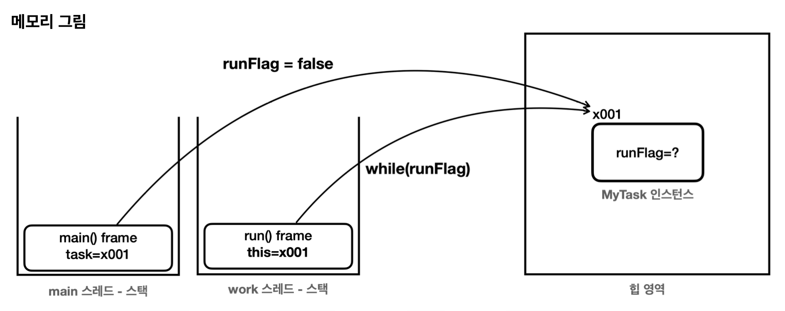
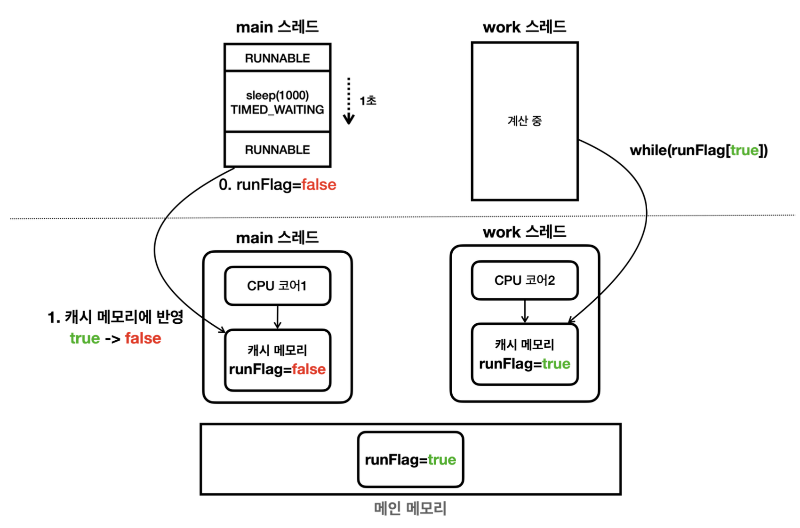
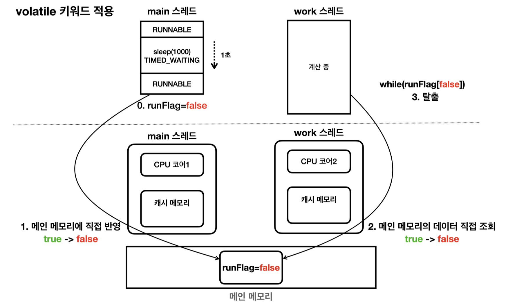

# 섹션 6. 메모리 가시성

## volatile, 메모리 가시성

```java
 public class VolatileFlagMain {
     public static void main(String[] args) {
         MyTask task = new MyTask();
         Thread t = new Thread(task, "work");
         log("runFlag = " + task.runFlag);
         t.start();
         sleep(1000);
         log("runFlag를 false로 변경 시도"); 
         task.runFlag = false; 
         log("runFlag = " + task.runFlag); 
         log("main 종료");
     }
     static class MyTask implements Runnable {
	     boolean runFlag = true;  //volatile boolean runFlag = true;
         @Override
         public void run() {
	         log("task 시작"); 
	         while (runFlag) { // runFlag가 false로 변하면 탈출 
	         }
	         log("task 종료"); 
	       }
	   } 
}
```

위 코드에서 runFlag를 false로 만들었기 때문에 MyTask의 인스턴스인 task를 수행하고 있는 Thread t 의 while 문을 빠져나올 것이라고 생각하지만 실제 실행 결과에서는 빠져나오지 못한다.



main 스레드와 work 스레드 모두 runFlag는 MyTask 인스턴스에 있는 runFlag를 사용한다.

> 즉, 이 값을 false로 변경하면 work 스레드의 작업을 종료해야 맞다.

하지만 실행 결과는 work스레드가 종료가 되지 않는다. 왤까?

### 메모리 가시성 문제

실제 메모리의 접근 방식

CPU는 처리 성능을 개선하기 위해 중간에 캐시 메모리를 사용



자바 프로그램이 처음 시작하게 되면 main 스레드와 work 스레드 모두 runFlag 값을 캐시 메모리로 불러온다.

이 후 main 스레드에서 runFlag 값에 변경이 발생하면 메인 메모리에 바로 반영X, 캐시 메모리에 반영

따라서, 위와 같이 work 스레드의 runFlag는 변경이 반영되지 않아 루프를 탈출하지 못하는 문제 발생

- 캐시 메모리 → 메인 메모리
- 메인 메모리 → 캐시 메모리 

변경 내용 반영은 언제 일어날까?

- CPU의 설계 방식과 실행 환경에 따라 다르다
- 주로 컨텍스트 스위칭때 반영됨
    - 캐시 메모리를 비워야 하기 때문 → 보장X

### 해결 방법

성능을 포기하고(캐시 메모리를 사용하지 않고) 값을 읽을 때 메인 메모리에 직접 접근



---

### 실시간성을 반영하여 메모리의 가시성을 확인

main 스레드

- runFlag의 값이 false가 될 때 count 값을 로그로 출력하는 코드

work 스레드

- 1억번에 한번씩 로그를 찍는 코드 + runFlag의 값이 false가 될 때 count 값을 로그로 출력하는 코드

를 추가한다면?

### volatile를 사용하지 않는 경우

main 스레드가 flag를 false로 변경한 시점에 count값과

work 스레드가 flag를 false로 변경한 시점이 서로 다르다.

- main 스레드가 flag를 변경하면 main 스레드의 캐시 메모리에 반영

- 캐시 메모리에서 메인 메모리로 반영

- 메인 메모리에서 work 스레드의 캐시 메모리로 반영

이 과정에 시간이 걸리기 때문에 두 시점이 서로 다르다.

### volatile를 사용하는 경우

main 스레드와 work 스레드가 flag를 false로 변경하는 시점이 정확하게 같다.

→ 하지만 count 값이 더 적음 (성능이 떨어짐)

## 자바 메모리 모델

자바가 어떻게 메모리에 접근하고 수정할 수 있는지 규정

### happens-before

자바 메모리 모델에서 스레드 간의 작업 순서를 정의하는 개념

- Task A가 Task B 보다 happens-before 관계에 있다
    
    → Task A의 메모리 변경 사항은 Task B가 시작되기 전에 모두 메모리에 반영됨
    

> 즉, 한 스레드에서 수행한 작업을 다른 스레드가 참조할 때 최신 상태가 보장 되는 것

---

### 발생하는 경우

> 프로그램 순서 규칙

먼저 작성되면 먼저 실행된다. ex) int a = 1; int b = 2; → a가 b보다 먼저 실행

> volatile 변수 규칙

volatile 변수의 쓰기작업은 읽기작업보다 happens-before 관계를 형성

→ 쓰기가 발생하면 읽기는 반드시 최신 상태를 보장한다

> 스레드 시작 규칙

Thread.start()가 호출되면, 호출 전에 수행된 모든 작업은 새로운 스레드가 시작된 후 작업보다 happens-before

→ 새로 실행한 스레드는 기존 작업들에 대한 데이터를 받아야 하므로

> 스레드 종료 규칙

Thread.join()을 호출하면, join 대상 스레드의 모든 작업은 join()이 반환된 후 작업보다 happens-before

→ 종료가 되었을 때, 메인스레드에서 해당 스레드의 값을 꺼낼 때 그 값이 최신화 되어 있어야 한다

> 인터럽트 규칙

Thread.interrupt()를 호출하는 작업이, 인터럽트 된 스레드가 인터럽트를 감지하는 시점의 작업보다 happens-before

→ interrupt() 호출 후, 해당 스레드의 인터럽트 상태를 확인하는 작업이 happens-before

인터럽트를 걸면 즉시 걸린다는 뜻

> 객체 생성 규칙

객체의 생성자에서 초기화된 필드는 생성자가 완료된 후 다른 스레드에서 참조될 때 happens-before

→ 객체가 완전히 생성 되어야 다른 스레드에 의해 참조가 될 수 있도록 보장
