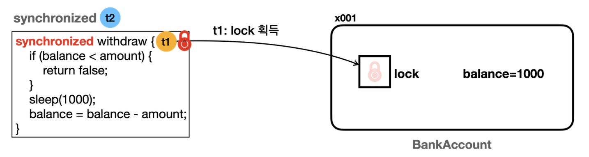

# 섹션 7. 동기화 - synchronized

멀티스레드의 가장 주의해야할 점

같은 자원에 여러 스레드가 동시에 접근할 때 발생하는 동시성 문제

- 이런 공유 자원에 대한 접근을 적절하게 동기화(synchronization)해서 동시성 문제 방지를 해야함

volatile를 사용하면 동시성 문제를 방지할 수 있을까?

- 정답은 X 

volatile는 한 스레드가 값을 변경했을 때 다른 스레드에서 변경된 값을 즉시 볼 수 있게 해주는 것일 뿐

근본적인 동시성 문제는 해결 해주지 않는다. (메모리 가시성 문제 ∈ 동시성 문제)

## 임계 영역(critical section)

동시성 문제는 여러 스레드가 함께 사용하는 공유 자원을 여러 단계로 (원자성 X) 나누어 사용하기 때문에 발생

### 임계 영역

여러 스레드가 동시에 접근해서는 안되는 공유 자원에 접근하거나 수정하는 부분

자바에서는 `synchronized` 키워드를 통해 임계 영역 설정

## synchronized 메서드

synchronized 메서드가 붙으면 해당 메서드는 하나의 스레드만 호출할 수 있다.

- 모든 객체는 내부에 고유의 락(모니터 락)을 가지고 있다.
- 스레드가 synchronized 키워드가 붙은 메서드에 진입하기 위해서는 반드시 락을 보유해야 한다.

락을 보유한 t1 스레드는 `RUNNABLE` 상태로 CPU 스케줄링에 들어가게 되고, 

락을 획득하지 못한 t2 스레드는 `BLOCKED` 상태로 무한정 대기한다.

이후 t1 스레드가 메서드를 끝내고 락을 반납하면 락을 대기중이던 스레드는 자동으로 락 획득

- BLOCKED 상태이던 락을 대기중인 스레드가 `RUNNABLE`로 전이

**락을 획득하는 순서는 보장되지 않는다**

> 참고 : `volatile`를 사용하지 않아도 `synchronized` 안에서 접근하는 변수의 메모리 가시성 문제는 해결됨

## synchronized 코드 블럭

**`synchronized` 는 한 번에 하나의 스레드만 실행할 수 있기 때문에 성능이 떨어진다.**

- 그러므로 꼭 필요한 곳을 한정해서 설정해야함 → 코드 블럭

synchronized (this) {} 로 안전한 임계 영역을 코드 블럭으로 지정 가능

동기화를 사용하면

- 경헙 조건(Race condition) : 두 개 이상의 스레드가 경쟁적으로 동일한 자원을 수정할 때 발생하는 문제
- 데이터 일관성 : 여러 스레드가 동시에 읽고 쓰는 데이터의 일관성 유지

를 해결할 수 있다.

과도하게 사용하면 성능 저하를 초래하므로 필요한 부분에만 적용해야 함

## synchronized 장 단점

장점

- 프로그래밍 언어에 문법으로 사용 가능
- 편리
- 자동 잠금 해제 : synchronized 메서드나 블록이 완료되면 자동으로 락을 대기중인 스레드의 잠금이 해제됨

단점

- 무한 대기 : `BLOCKED` 상태의 스레드는 락이 풀릴 때 까지 무한 대기
    - 타임 아웃, 인터럽트 모두 불가능
- 공정성 : 락이 반환된 후, 어떤 스레드가 락을 획득할 지 알 수 없음 → 기아 상태(starvation)에 빠질 수 있음